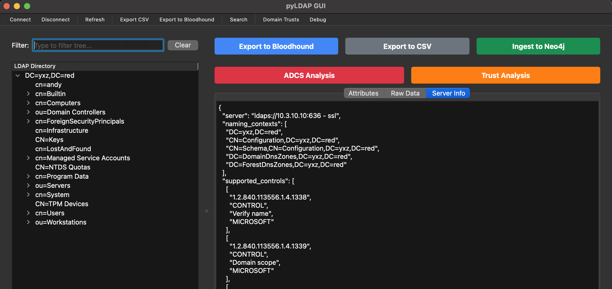
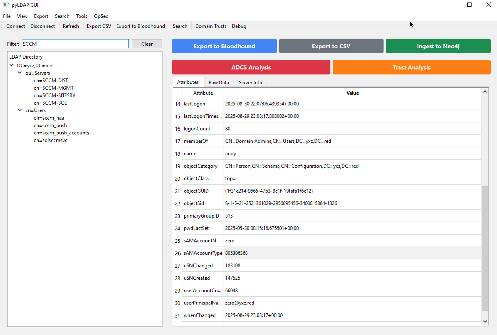

# pyLDAPGui


_Logo based on OG [BloodHound](https://github.com/SpecterOps/BloodHound) logo with some python permutations_

What started out as a GUI test and something to muck about with has sort of grown arms and legs. As it stands this is a cross platform GUI app for browsing LDAP and will direct YOLO into a Neo4J database, it comes with LDAP/LDAPS browsing capabilites, it'll run standalone and you can modify it how you like.

I wanted this to be similar to Sysinternals' ADExplorer with the GUI Experience in mind and tree view, also additional direct connect to a neo4j DB or export to CSV/BH data for ease of use.

## Requirements

- Python 3.8 or higher
- requirements.txt - install them all in a venv

## Installation


```bash
git clone https://github.com/zephrfish/pyLDAPGui
cd pyLDAPGui
python3 -m venv venv
source venv/bin/activate
pip3 install -r requirements.txt
```


## Usage

### Basic Operation

1. **Start the application** (or if you're on windows you can pyinstaller the exe and run the standalone exe):
```bash
python main.py
```
Here's some pretty screenshots of working on Mac and Windows:


Windows Tree filter:


Demo Video of Ingest to BloodHound 4.x:
<blockquote class="twitter-tweet" data-media-max-width="560"><p lang="en" dir="ltr">Featuring Koven - Good Enough as a background track! <a href="https://t.co/KPPunRg4Cx">pic.twitter.com/KPPunRg4Cx</a></p>&mdash; @zephrfish.yxz.red (@ZephrFish) <a href="https://twitter.com/ZephrFish/status/1966537323140567132?ref_src=twsrc%5Etfw">September 12, 2025</a></blockquote> <script async src="https://platform.twitter.com/widgets.js" charset="utf-8"></script>


_this may or may not load_

2. **Connect to LDAP server**:
   - Click "Connect" in toolbar or File menu
   - Enter connection details:
     - Server: LDAP server hostname or IP
     - Port: 389 (standard) or 636 (SSL)
     - Username: Full DN or domain\username format
     - Password: Authentication password
   - Check "Use SSL/TLS" for secure connections
   - **Proxy Settings** (Optional):
     - Enable proxy for restricted environments
     - Support for SOCKS4, SOCKS5, and HTTP proxies
     - Configure proxy host, port, and authentication
   - Optionally save as profile for future use

3. **Browse directory**:
   - Expand tree nodes to explore structure
   - Click entries to view attributes in detail
   - Use tabs to switch between attributes, raw data, and server info
   - Filter tree entries using the search box (Ctrl+Shift+F)

4. **Advanced search**:
   - Use Search > Search... (Ctrl+F) for LDAP filter queries
   - Select from pre-built common filters
   - Export search results directly to CSV or Bloodhound

5. **Export data**:
   - **CSV**: File > Export to CSV for spreadsheet analysis
   - **Bloodhound Legacy**: File > Export to Bloodhound for graph visualisation (4.3 format)
   - **Neo4j**: File > Ingest to Neo4j for direct database import
   - Use prominent export buttons in main interface

### Keyboard Shortcuts

- `Ctrl+F` - Open advanced search dialog
- `Ctrl+Shift+F` - Focus tree filter input
- `Ctrl+E` - Export to CSV
- `Ctrl+B` - Export to Bloodhound
- `Ctrl+N` - Ingest to Neo4j
- `Ctrl+Q` - Quit application

## Features and Things 

### LDAP Connection Management
- Connect to LDAP servers with username/password authentication
- Support for SSL/TLS connections
- **SOCKS Proxy Support**: Connect through SOCKS4/SOCKS5/HTTP proxies
  - Ideal for restricted environments or isolated networks
  - Support for proxy authentication
  - Profile-based proxy configuration
- Auto-discovery of base DN and server capabilities
- Save and manage connection profiles with encrypted password storage
- Quick connect using saved profiles

### Directory Browsing
- Tree-based navigation of LDAP directory structure
- Lazy loading for efficient browsing of large directories
- Real-time tree filtering with keyboard shortcuts
- View all attributes of selected entries
- Raw data view in JSON format
- Server information display
- Prominent export buttons for quick access


### Export Capabilities
- **CSV Export**: Complete attribute data with pipe-separated multi-values
- **Bloodhound 4.3 Legacy Export**: 
  - Compatible with Bloodhound 4.3 Legacy (not CE)
  - Proper object type mapping for users, computers, groups, OUs, domains
  - Security flags and attributes (UAC flags, SPNs, etc.)
  - Automatic SID conversion from binary to string format
  - Support for large-scale exports (50,000+ objects)
  - Creates ZIP file with separate JSON files per object type
- **Neo4j Direct Ingestion**: 
  - Connect directly to BloodHound's Neo4j database
  - Real-time progress tracking during ingestion
  - Creates nodes and relationships without intermediate files
  - Supports all object types and security relationships
  - Optional: Requires neo4j-driver package
- **BloodHound OpenGraph Export**  - TODO

### Additional Options
- **Throttling Mode** (Enabled by Default): Randomises query order and timing to avoid detection
  - Configurable delays between queries (0.5-2s default)
  - Multiple timing presets: Fast, Normal, Stealthy
  - Makes enumeration patterns unpredictable
- Encrypted password storage for saved profiles using Fernet encryption
- SSL/TLS support for secure connections
- Admin count tracking and delegation flags detection
- SOCKS proxy support (SOCKS4/5, HTTP) for restricted environments
- **ADCS Certificate Template Analysis** (NEW):
  - Comprehensive vulnerability analysis for Active Directory Certificate Services
  - Detection of ESC1-ESC8 vulnerabilities
  - Risk scoring for certificate templates
  - Permission analysis and attack path identification
  - Export findings to JSON, CSV, or BloodHound format
  - Detailed remediation recommendations
- **Domain Trust Analysis**: Browse and analyse trust relationships with export capabilities (currently a WIP)


### Configuration Files

- **Connection Profiles**: `ldap_profiles.json` (encrypted passwords)
- **Encryption Key**: `.ldap_key` (hidden file used for encrypting passwords in ldap profiles, auto-generated)

### Proxy Configuration (I've tested this in my lab and it works but YMMV)

The application supports connecting to LDAP servers through proxy servers, which is useful for:
- Accessing domain controllers in isolated networks
- Pentesting
- Connecting through jump hosts or bastion servers

**Supported Proxy Types**:
- **SOCKS5**: Full protocol support with authentication
- **SOCKS4**: Basic proxy support
- **HTTP**: HTTP CONNECT proxy support

**Configuration**:
1. Check "Use Proxy" in the connection dialog
2. Select proxy type (SOCKS5 recommended)
3. Enter proxy host and port
4. Optionally provide proxy authentication credentials
5. Save as profile for reuse

## Building Executables

### Windows
```bash
pip install pyinstaller
pyinstaller --onefile --windowed --name pyLDAPGui main.py
```

### macOS/Linux
```bash
pip install pyinstaller
pyinstaller --onefile --name pyLDAPGui main.py
```

The executable will be created in the `dist/` directory.

## Troubleshooting

### Connection Issues
- Verify LDAP server address and port
- Check firewall and network connectivity  
- Ensure correct authentication credentials
- Try both SSL and non-SSL connections
- Verify LDAP server is accepting connections

### Debugging Export / Debugging
- **Bloodhound Import Fails**: Ensure using Bloodhound 4.3 Legacy, not CE
- **OpenGraph Format**: Use for newer BloodHound versions that support OpenGraph schema
- **Large Exports**: May take time for domains with many objects
- **Missing Data**: Check LDAP permissions and search scope
- Use tree filtering for large directories
- Limit search results for better performance
- Close and reconnect if connection becomes slow

## Known Limitations

- Read-only access (no LDAP modification capabilities)
- Certificate validation bypass for SSL, you can use LDAPS but it will just blindly trust the TLS cert because YOLO 
- Maximum 50,000 entries per Bloodhound export (configurable)
